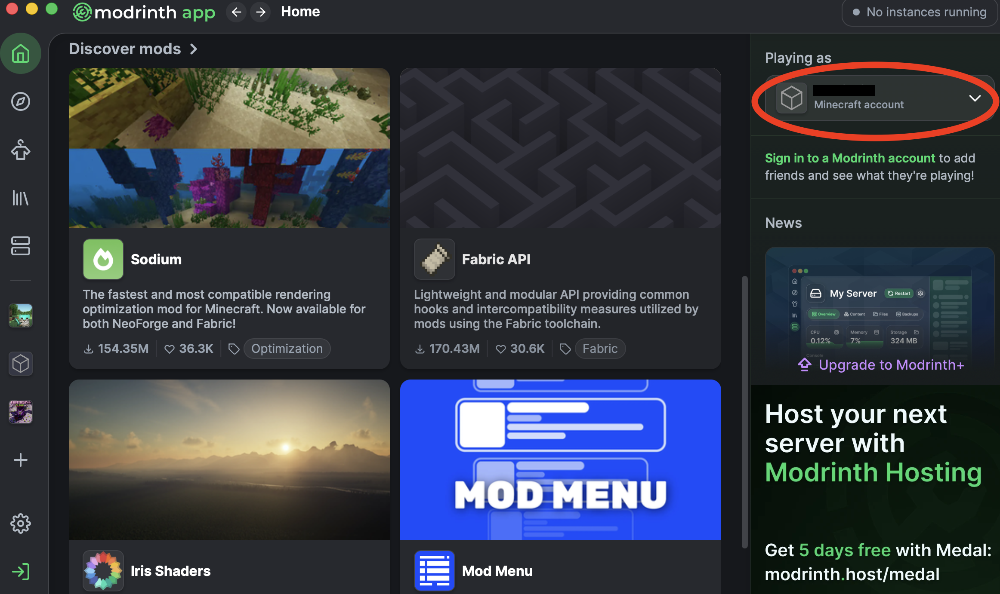
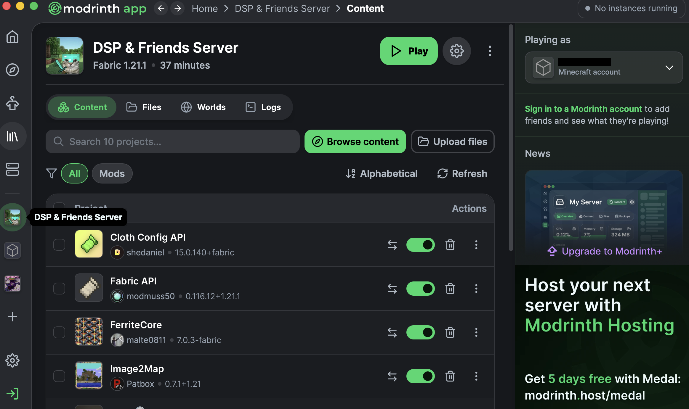

# Server Setup & Rules 

## Table of Contents 
1. [Setup](#setup)
2. [Rules](#rules)
3. [Mods Tips and Tricks](#mods-tips-and-tricks)

---

## Setup 
1. Download the Modrinth Client: https://modrinth.com/app
2. Download the [Modrinth modpack file](https://github.com/leeann-s/dsp-minecraft/blob/main/DSP%20%26%20Friends%20Server.mrpack), it's also in the repository 
3. Once Modrinth finishes downloading, open the `.mrpack` file by double-clicking it. It should automatically import into Modrint
4. Log into your Minecraft Account, you should see your account in the top right afterward


6. You should see the **DSP & Friends Server** modpack on the left navigation bar


8. Launch the new Minecraft instance by clicking play, click multiplayer mode, and add the IP (check Discord or ask a friend for it)
9. **Have fun!** and invite your friends :D 

---

## Rules 
1. No griefing!! 😡
2. No going into the end dimension (James thinks you will all follow this rule without other enforcements in place...)
3. **DO NOT SPAM IMAGES. IT CAUSES LAG**
4. The server ends on June 11 because I don't want to pay $31.99 and renew it for another month 

---

## Mods Tips and Tricks 

This server is mostly vanilla with some mods that add performance improvements, voice chat, custom images, and other random things.

### Voice Chat

We use **Simple Voice Chat** for proximity voice chat in game!! This means we don't need to use the voice channel in Discord :D 

After joining the server:
1. Press "V"
2. Choose either **Voice Activation** or **Push to Talk**
3. Make sure Modrinth/Minecraft/Java has microphone permission (you might need to go into system settings to fix this)
4. Scare people in-game!

### Image2Map

Adding custom images in-game! Please do not abuse this by spamming images :( 

Run this command with a direct image link:
```mc
/image2map create <image-url>
```

### Other mods you probably care about less 

- **Sodium**: improves FPS
- **Lithium**: improves game performance
- **FerriteCore**: reduces memory usage
- **ModernFix**: improves loading/performance
- **Jade**: shows what block/entity you are looking at
- **Xaero’s Minimap**: adds a minimap and waypoints
- **Vanilla Tweaks** (not a mod but idk where else to include it): multiplayer sleep, player head drops, afk display, track statistics, armor statues, and a few more 


